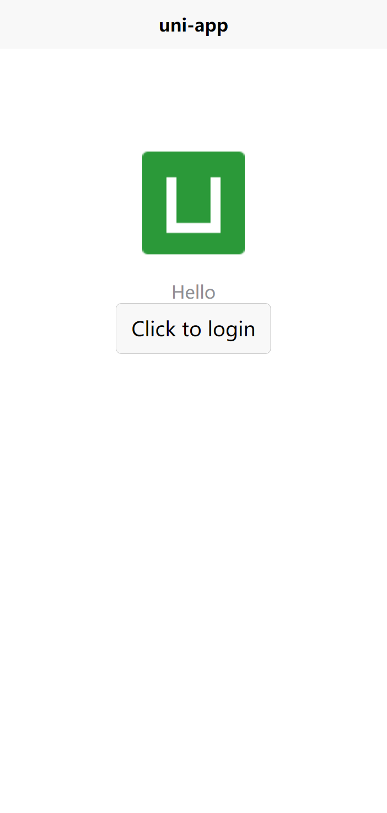
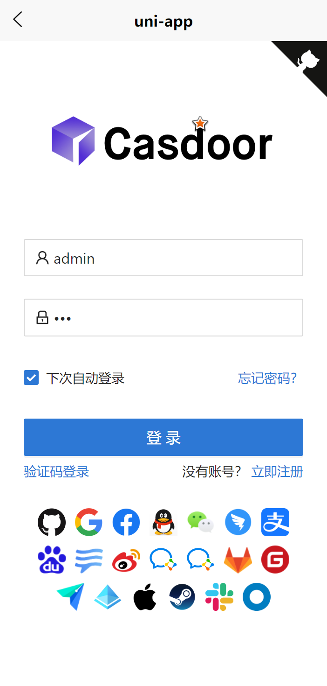

<h1 align="center" style="border-bottom: none;">Casdoor Uniapp SDK Example</h1>

## 	The example uses the following casdoor server:

The server: https://door.casdoor.com/


## Quick Start
```bash
git clone https://github.com/casdoor/casdoor-uniapp-example.git
cd casdoor-uniapp-example/example
yarn install
yarn server
```
After running, you will see the following two interface:

<div style="margin: 0 auto;"> </div>

## configure

An example of a configuration is as follows:

```js
import App from './App'
// #ifndef VUE3
import Vue from 'vue'
import Sdk from 'casdoor-uniapp-sdk'
Vue.config.productionTip = false
Vue.use(Sdk, {
  serverUrl: "https://door.casbin.com", //casdoor server url
  clientId: "014ae4bd048734ca2dea",
  organizationName: "casbin",
  appName: "app-casnode",
  redirectPath: "/callback",
})
App.mpType = 'app'
const app = new Vue({
    ...App
})
app.$mount()
```

The meanings of some fields are explained as follows:

| Name (in order)  | Must | Description                                         |
| ---------------- | ---- | --------------------------------------------------- |
| serverUrl  | Yes  | your Casdoor server URL               |
| clientId         | Yes  | the Client ID of your Casdoor application                        |
| appName           | Yes  | the name of your Casdoor application |
| organizationName     | Yes  | the name of the Casdoor organization connected with your Casdoor application                    |
| redirectPath     | No  | the path of the redirect URL for your Casdoor application, will be `/callback` if not provided              |


