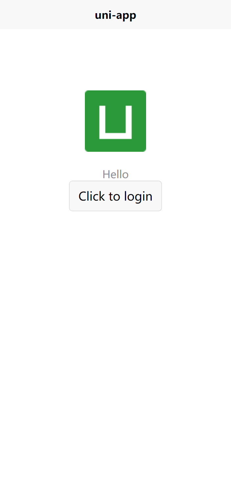
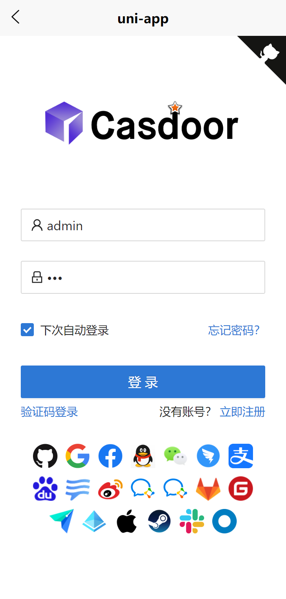

# Casdoor uni-app Example

[](https://github.com/casdoor/casdoor-uniapp-example/actions/workflows/build.yml)
[](https://github.com/casdoor/casdoor-uniapp-example/blob/master/LICENSE)
[](https://discord.gg/5rPsrAzK7S)

An example [uni-app](https://uniapp.dcloud.net.cn/) (Vue 2) that opens the [Casdoor](https://casdoor.ai/) sign-in page, using [casdoor-uniapp-sdk](https://github.com/casdoor/casdoor-uniapp-sdk).

 

## How it works

1. [src/main.js](src/main.js) installs casdoor-uniapp-sdk with the settings of the Casdoor application. The SDK adds `getSigninUrl()`, `getSignupUrl()`, `getMyProfileUrl()` and `signin()` to every page.
2. **Login with Casdoor** on [the home page](src/pages/index/index.vue) opens [webpage.vue](src/pages/index/webpage.vue), which shows the URL of `getSigninUrl()` in a `<web-view>`.
3. After signing in, Casdoor redirects to the redirect URL of the app (`/callback`) with `code` and `state`. Exchange the code for a token on your backend, see [casdoor-nodejs-react-example](https://github.com/casdoor/casdoor-nodejs-react-example) for an example of the backend.

## Prerequisites

- Node.js 18+ and Yarn
- A Casdoor server. The example is preconfigured for the public demo server https://door.casdoor.com, so it runs as is. To use your own, see [Casdoor installation](https://casdoor.ai/docs/basic/server-installation).

## Configuration

Skip this section to try the example with the public demo server.

In your Casdoor, create (or reuse) an organization and an application, and add the callback URL of your app (for example `http://localhost:8080/callback` for H5) to the application's **Redirect URLs**. Then fill in [src/main.js](src/main.js):

```js
Vue.use(Sdk, {
  serverUrl: "https://door.casdoor.com", // Casdoor server URL
  clientId: "014ae4bd048734ca2dea", // client ID of the application
  organizationName: "casbin", // organization of the application
  appName: "app-casnode", // name of the application
  redirectPath: "/callback", // path of the redirect URL, /callback by default
})
```

## Run

```shell
git clone https://github.com/casdoor/casdoor-uniapp-example
cd casdoor-uniapp-example
yarn install
yarn serve
```

Open the H5 app at the URL printed in the terminal and click **Login with Casdoor**. On the demo server, sign in with username `admin` and password `123`.

Other platforms use the `dev:*` and `build:*` scripts of [package.json](package.json), for example `yarn dev:mp-weixin` for WeChat Mini Programs, or open the project in [HBuilderX](https://www.dcloud.io/hbuilderx.html).

The uni-app 2 CLI uses webpack 4, so the scripts set `NODE_OPTIONS=--openssl-legacy-provider` to run it on Node.js 17 and later.

## Resources

- [Casdoor documentation](https://casdoor.ai/docs/overview)
- [casdoor-uniapp-sdk](https://github.com/casdoor/casdoor-uniapp-sdk)

## License

[Apache-2.0](LICENSE)
